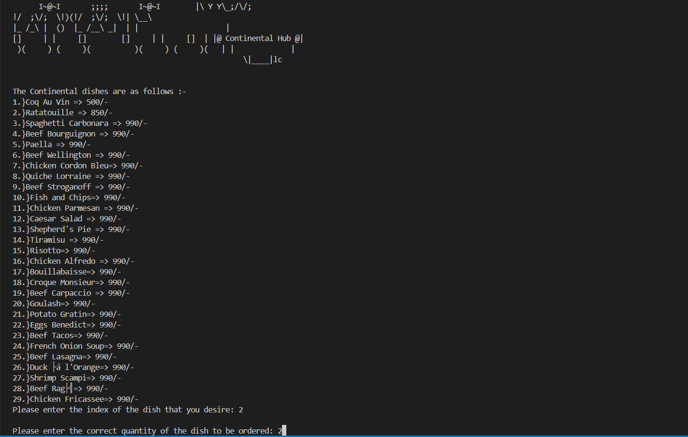
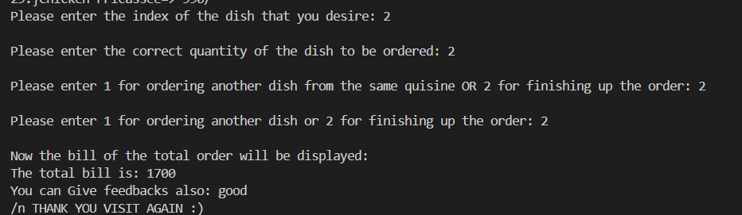
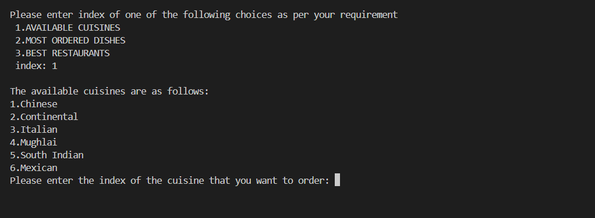

# 🍽️ Food Frenzy – C++ Terminal-Based Food Ordering System

**Food Frenzy** is a CLI-based food ordering application built using C++. It simulates a restaurant ordering system where users can browse menus from different cuisines, add items to cart, and generate bills – all from the terminal!

---

## 🚀 Features

- 🔐 Login system with username and password
- 🧾 Categorized menu system (Italian, Chinese and many more) 
- 🛒 Real-time cart updates with quantity and price
- 💰 Automated billing and summary
- 📋 Feedback collection after order completion
- 📂 Persistent data handling using File I/O

---

## 🛠️ Tech Stack

- **Language:** C++
- **Concepts Used:** Structs, File Handling, Loops, Conditionals, Functions
- **Lines of Code:** 1000+

---

## 📸 Screenshots


  |  |  

---

##  How to Run

1. Clone the repository  
```bash
git clone https://github.com/Hitanshi1002/FoodFrenzy.git
cd FoodFrenzy
